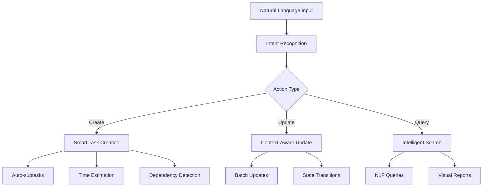

# MCP Görev Yönetim Sistemi - AI Kullanıcı Perspektifi Analizi

> **Dokümantasyon Amacı**: Bu doküman, MCP görev yönetim sisteminin AI kullanıcıları tarafından nasıl deneyimlendiğini, karşılaşılan zorlukları ve sistem iyileştirmeleri için önerileri detaylandırır. Başka bir AI'ın bu sistemi geliştirirken referans olarak kullanabileceği şekilde hazırlanmıştır.

## 📋 Executive Summary

MCP görev yönetim sistemi, doğal dil işleme yetenekleri ve esnek yapısıyla AI kullanımına uygun bir sistem. Ancak, AI'ların daha efektif kullanabilmesi için context yönetimi, otomatik durum güncellemeleri ve görselleştirme araçları gibi alanlarda iyileştirmeler gerekiyor.

**Kritik Metrikler:**

- 147 görevden 114'ü (%77.5) "beklemede" durumunda
- 0 görev aktif olarak "devam ediyor" durumunda
- Bu durum, AI kullanıcıların görev durumlarını güncellemeyi unuttuğunu gösteriyor

## 🔍 Current State Analysis

### Sistem Özellikleri

```yaml
Temel Fonksiyonlar:
  - Doğal dil ile görev oluşturma: ✅ Mükemmel
  - Hiyerarşik görev yapısı: ✅ Çok iyi
  - Template sistemi: ✅ İyi (4 template mevcut)
  - Proje yönetimi: ✅ Yeterli
  - Bağımlılık yönetimi: ✅ Var ama az kullanılıyor

API Komutları:
  - gorev_olustur: Doğal dil desteği ile
  - gorev_duzenle: Kısmi güncelleme imkanı
  - gorev_guncelle: Sadece durum değişikliği
  - gorev_listele: Filtreleme ve sıralama
  - gorev_detay: Markdown formatında detay
  - template_listele/templateden_gorev_olustur: Template desteği
```

### AI Kullanım Patternleri

```json
{
  "common_patterns": {
    "task_creation": "Doğal dil → gorev_olustur → ID döner",
    "task_update": "ID hatırlama zorluğu → Listele → Güncelle",
    "status_tracking": "Manuel durum güncelleme → Çoğu zaman unutuluyor",
    "context_switching": "Aktif proje kavramı → Bazen kafa karıştırıcı"
  }
}
```

## 🚨 AI-Specific Challenges

### 1. Context Management Problemi

**Sorun**: Uzun konuşmalarda hangi görev üzerinde çalışıldığının takibi

```
Örnek Senaryo:
- AI: "123 ID'li görevi oluşturdum"
- (10 mesaj sonra)
- Kullanıcı: "Bu görevi güncelle"
- AI: ❓ Hangi görev?
```

**Etki**: Sürekli görev listesi sorgulamak zorunda kalma

### 2. State Transition Unutkanlığı

**Sorun**: Görev durumlarını güncellemeyi unutma

```
Tipik Akış:
1. Görev oluştur → "beklemede"
2. Görev üzerinde çalış → (durum güncelleme yok)
3. Görev tamamla → (hala "beklemede")
```

**Kanıt**: 147 görevden 0'ı "devam ediyor" durumunda

### 3. Bulk Operations Eksikliği

**Sorun**: Birden fazla ilişkili görevi tek tek güncelleme zorunluluğu

```
Mevcut:
- Her görev için ayrı API çağrısı
- ID'leri hatırlama zorluğu
- Zaman kaybı
```

### 4. Visualization Gap

**Sorun**: 147 görevin mental modelini oluşturma zorluğu

```
İhtiyaç:
- Proje bazlı görev dağılımı
- İlerleme görselleştirmesi
- Bağımlılık haritası
```

## 💡 Improvement Recommendations

### Priority 1: Smart Context Management

```typescript
interface AIContext {
  currentTask?: string;        // Aktif görev ID
  recentTasks: string[];       // Son 5 etkileşimli görev
  workingProject?: string;     // Aktif proje
  sessionSummary: {           // Oturum özeti
    created: number;
    updated: number;
    completed: number;
  };
}

// Önerilen yeni komutlar:
gorev_context_get()          // Mevcut context'i döner
gorev_context_set(taskId)    // Aktif görevi belirler
gorev_continue()             // Son göreve devam eder
```

### Priority 2: Automatic State Management

```yaml
Otomatik Kurallar:
  - gorev_detay çağrıldığında:
      if status == "beklemede":
        auto_update_status("devam_ediyor")
  
  - Alt görev tamamlandığında:
      check_parent_completion()
      
  - 30 dakika inaktivite:
      if status == "devam_ediyor":
        auto_update_status("beklemede")
```

### Priority 3: AI-Optimized Commands

```python
# Yeni komut önerileri:

def gorev_ai_summary():
    """AI için optimize edilmiş özet"""
    return {
        "working_on": current_task,
        "next_priorities": top_5_by_priority,
        "blockers": tasks_with_dependencies,
        "overdue": past_deadline_tasks,
        "suggestions": ai_generated_next_steps
    }

def gorev_batch_update(updates: List[TaskUpdate]):
    """Toplu güncelleme"""
    # Birden fazla görevi tek seferde güncelle
    
def gorev_smart_create(description: str):
    """Akıllı görev oluşturma"""
    # Otomatik alt görevlere bölme
    # Tahmini süre ekleme
    # İlgili görevleri bulma
```

### Priority 4: Enhanced Natural Language Processing

```yaml
Geliştirilmiş NLP Özellikleri:
  
  Relative References:
    - "son oluşturduğum görev"
    - "database ile ilgili görevler"
    - "bugün tamamladığım görevler"
  
  Bulk Actions via NLP:
    - "tüm bug'ları yüksek önceliğe al"
    - "frontend görevlerini UI projesine taşı"
    - "tamamlanan görevleri arşivle"
  
  Smart Interpretations:
    - "bu görevi yarın yapalım" → son_tarih: tomorrow
    - "önce şunu bitirelim" → öncelik: yüksek
    - "buna bağlı" → otomatik bağımlılık
```

### Priority 5: Integration Hooks

```javascript
// AI aktivitelerini otomatik göreve dönüştürme

onFileEdit: (file) => {
  // Dosya düzenlendiğinde ilgili görevi güncelle
  updateTaskProgress(file.relatedTask);
}

onCodeReview: (comment) => {
  // Code review yorumlarından görev oluştur
  if (comment.includes("TODO") || comment.includes("FIXME")) {
    createTaskFromComment(comment);
  }
}

onCommit: (commit) => {
  // Commit mesajından görev güncellemesi
  const taskId = extractTaskId(commit.message);
  if (taskId) {
    updateTaskWithCommit(taskId, commit);
  }
}
```

## 🚀 Implementation Guidelines

### Phase 1: Quick Wins (1-2 hafta)

1. **Context Management API**

   ```bash
   # Basit context yönetimi
   - gorev_set_active(task_id)
   - gorev_get_active()
   - gorev_recent(limit=5)
   ```

2. **State Auto-Updates**

   ```python
   # Hook sistemi
   on_task_viewed: set_status("devam_ediyor")
   on_subtasks_complete: check_parent_status()
   ```

3. **Batch Operations**

   ```bash
   # Toplu işlemler
   gorev_bulk_update([
     {id: "123", status: "completed"},
     {id: "456", priority: "high"}
   ])
   ```

### Phase 2: Advanced Features (3-4 hafta)

1. **AI Summary Dashboard**

   ```yaml
   Format: YAML veya JSON
   İçerik:
     - Current sprint overview
     - Blockers and dependencies
     - Suggested next actions
     - Time estimates vs actuals
   ```

2. **Natural Language Queries**

   ```sql
   -- Örnek sorgular
   "Show me all high priority bugs"
   "What did I work on yesterday"
   "Tasks waiting for review"
   ```

3. **Smart Notifications**

   ```python
   # AI-relevant notifications
   - Task dependencies resolved
   - Deadline approaching
   - Related task completed
   ```

### Phase 3: AI-Native Features (2-3 ay)

1. **Predictive Task Management**
   - Otomatik süre tahmini
   - Risk analizi
   - Önceliklendirme önerileri

2. **Automated Workflows**
   - Task template öğrenme
   - Otomatik alt görev oluşturma
   - Pattern recognition

3. **Deep Integrations**
   - IDE plugins
   - Git hooks
   - CI/CD pipeline integration

## 📊 Success Metrics

```yaml
AI Kullanım Metrikleri:
  - Active Task Ratio: >20% (şu an 0%)
  - Context Switch Frequency: <5 per session
  - Bulk Operation Usage: >30% of updates
  - Auto-state Updates: >80% accuracy
  - Task Completion Rate: >60%
  
Kullanıcı Deneyimi:
  - Ortalama görev oluşturma süresi: <10 saniye
  - Context kaybı olayları: <1 per session
  - Manuel durum güncelleme ihtiyacı: <%20
```

## 🔮 Future Vision

### AI-First Task Management System



### Autonomous Task Management

1. **Self-Organizing Tasks**
   - Otomatik önceliklendirme
   - Dinamik deadline ayarlama
   - Resource allocation

2. **Predictive Assistance**
   - "Next best action" önerileri
   - Bottleneck detection
   - Workload balancing

3. **Learning System**
   - Task pattern recognition
   - User preference learning
   - Continuous optimization

## 🛠️ Technical Specifications

### Proposed API Enhancements

```typescript
interface EnhancedTaskAPI {
  // Context Management
  setActiveContext(taskId: string): void;
  getActiveContext(): TaskContext;
  
  // Bulk Operations
  batchUpdate(updates: TaskUpdate[]): BulkResult;
  batchCreate(tasks: TaskCreate[]): string[];
  
  // AI-Specific Queries
  queryNatural(query: string): Task[];
  getSummary(format: 'daily' | 'weekly' | 'sprint'): Summary;
  
  // Automation Hooks
  onTaskEvent(event: TaskEvent, handler: Function): void;
  registerAutomation(rule: AutomationRule): void;
}
```

### Data Schema Extensions

```sql
-- Önerilen yeni alanlar
ALTER TABLE tasks ADD COLUMN 
  estimated_hours INTEGER,
  actual_hours INTEGER,
  ai_context JSONB,
  automation_rules JSONB,
  interaction_count INTEGER DEFAULT 0,
  last_ai_interaction TIMESTAMP;

-- AI interaction tracking
CREATE TABLE ai_interactions (
  id UUID PRIMARY KEY,
  task_id UUID REFERENCES tasks(id),
  action_type VARCHAR(50),
  context JSONB,
  timestamp TIMESTAMP DEFAULT NOW()
);
```

## 📝 Conclusion

MCP görev yönetim sistemi, AI kullanıcılar için güçlü bir temel sunuyor. Önerilen iyileştirmelerle, sistem basit bir task tracker'dan AI-native bir proje yönetim platformuna dönüşebilir. Öncelikli olarak context yönetimi ve otomatik durum güncellemeleri ile başlanmalı, ardından daha gelişmiş AI özellikleri eklenmelidir.

**Next Steps:**

1. Context management API implementasyonu
2. Auto-state update rules engine
3. Batch operations support
4. AI summary dashboard
5. Natural language query interface

---

*Bu doküman, başka bir AI tarafından MCP görev sistemini geliştirirken referans olarak kullanılmak üzere hazırlanmıştır. Güncellemeler ve geri bildirimler için lütfen katkıda bulunun.*
