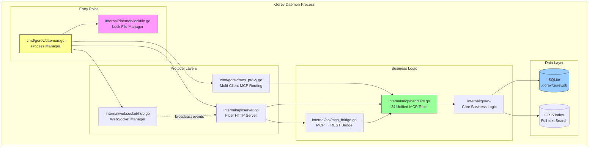

# Daemon Architecture - Gorev MCP Server

**Version:** v0.16.0+ | **Last Updated:** October 6, 2025 | **Status:** Production

---

## Table of Contents

1. [Overview](#overview)
2. [Architecture Components](#architecture-components)
3. [Lock File Mechanism](#lock-file-mechanism)
4. [Process Lifecycle](#process-lifecycle)
5. [Multi-Client MCP Proxy](#multi-client-mcp-proxy)
6. [REST API Server](#rest-api-server)
7. [WebSocket Real-Time Updates](#websocket-real-time-updates)
8. [VS Code Integration](#vs-code-integration)
9. [Security & Isolation](#security--isolation)
10. [Performance Considerations](#performance-considerations)
11. [Troubleshooting](#troubleshooting)

---

## Overview

Since v0.16.0, Gorev MCP Server operates as a **background daemon process**, providing persistent task management infrastructure with multi-client support. This architecture enables multiple AI assistants (Claude, VS Code, Windsurf, Cursor) to connect simultaneously while maintaining data consistency and real-time synchronization.

### Key Benefits

- **Single Instance Management**: One daemon serves all clients, preventing port conflicts
- **Persistent State**: Daemon survives client disconnections and IDE restarts
- **Multi-Client Support**: Multiple MCP clients can connect simultaneously
- **Real-Time Updates**: WebSocket broadcasts keep all clients synchronized
- **Auto-Start**: VS Code extension automatically manages daemon lifecycle
- **Resource Efficiency**: Shared database connections and caching across clients

### Design Philosophy

The daemon architecture follows these principles:

1. **Separation of Concerns**: MCP protocol, REST API, and WebSocket are independent layers
2. **Graceful Degradation**: Clients can still function if WebSocket fails
3. **Zero Configuration**: Works out-of-the-box with sensible defaults
4. **Developer Friendly**: Clear logging, health checks, and debugging endpoints

---

## Architecture Components

### Component Diagram



### Process Flow Diagram

```
┌─────────────────────────────────────────────────────────────────┐
│                      Gorev Daemon Process                        │
│                         (Port 5082)                              │
├─────────────────────────────────────────────────────────────────┤
│                                                                   │
│  ┌────────────────┐  ┌────────────────┐  ┌──────────────────┐  │
│  │  MCP Proxy     │  │  REST API      │  │  WebSocket       │  │
│  │  (stdio)       │  │  Server        │  │  Server          │  │
│  │                │  │  (Fiber)       │  │  (Gorilla WS)    │  │
│  └────────┬───────┘  └────────┬───────┘  └────────┬─────────┘  │
│           │                   │                    │             │
│           └───────────────────┴────────────────────┘             │
│                              │                                   │
│                    ┌─────────▼─────────┐                        │
│                    │  MCP Handler      │                        │
│                    │  (24 Unified      │                        │
│                    │   Tools)          │                        │
│                    └─────────┬─────────┘                        │
│                              │                                   │
│                    ┌─────────▼─────────┐                        │
│                    │  Business Logic   │                        │
│                    │  (internal/gorev) │                        │
│                    └─────────┬─────────┘                        │
│                              │                                   │
│                    ┌─────────▼─────────┐                        │
│                    │  SQLite Database  │                        │
│                    │  (.gorev/gorev.db)│                        │
│                    └───────────────────┘                        │
│                                                                   │
└─────────────────────────────────────────────────────────────────┘

External Clients:
┌──────────────┐  ┌──────────────┐  ┌──────────────┐  ┌──────────┐
│ Claude Code  │  │ VS Code Ext  │  │   Windsurf   │  │  Cursor  │
│ (MCP/stdio)  │  │ (REST API)   │  │ (MCP/stdio)  │  │(MCP/stdio│
└──────┬───────┘  └──────┬───────┘  └──────┬───────┘  └────┬─────┘
       │                 │                 │                │
       └─────────────────┴─────────────────┴────────────────┘
                               │
                    ┌──────────▼──────────┐
                    │  Lock File Monitor  │
                    │ ~/.gorev-daemon/    │
                    │      .lock          │
                    └─────────────────────┘
```

### Component Responsibilities

| Component | File | Port | Purpose |
|-----------|------|------|---------|
| **Daemon Manager** | `cmd/gorev/daemon.go` | - | Process lifecycle management |
| **Lock File** | `internal/daemon/lockfile.go` | - | Single instance enforcement |
| **MCP Proxy** | `cmd/gorev/mcp_proxy.go` | stdio | Multi-client MCP protocol routing |
| **REST API** | `internal/api/server.go` | 5082 | VS Code extension endpoints (23) |
| **WebSocket** | `internal/websocket/` | 5082/ws | Real-time task update broadcasts |
| **MCP Handlers** | `internal/mcp/handlers.go` | - | 24 unified MCP tools |
| **Business Logic** | `internal/gorev/` | - | Task management core |
| **Health Monitor** | `internal/daemon/health.go` | - | Liveness & readiness checks |

---

## Lock File Mechanism

The lock file ensures **single daemon instance** per user and provides **service discovery** for clients.

### Location

- **Linux/macOS:** `~/.gorev-daemon/.lock`
- **Windows:** `%USERPROFILE%\.gorev-daemon\.lock`

### Structure

```json
{
  "pid": 12345,
  "port": "5082",
  "start_time": "2025-10-06T10:30:00Z",
  "daemon_url": "http://localhost:5082",
  "version": "0.16.3"
}
```

### Lock File Lifecycle

```go
// 1. Daemon startup - Check existing lock
func StartDaemon() error {
    lock, err := lockfile.Read()
    if err == nil {
        // Lock exists, check if process is alive
        if isProcessAlive(lock.PID) {
            return fmt.Errorf("daemon already running (PID: %d)", lock.PID)
        }
        // Stale lock, clean up
        os.Remove(lockfile.Path())
    }

    // 2. Create new lock
    lock = &LockFile{
        PID:       os.Getpid(),
        Port:      "5082",
        StartTime: time.Now(),
        DaemonURL: "http://localhost:5082",
        Version:   "0.16.3",
    }
    lockfile.Write(lock)

    // 3. Register cleanup on exit
    defer lockfile.Remove()

    // 4. Start daemon services
    startServices()
}
```

### Client Discovery

```typescript
// VS Code extension discovers daemon via lock file
async function connectToDaemon(): Promise<string> {
    const lockPath = path.join(os.homedir(), '.gorev-daemon', '.lock');

    if (fs.existsSync(lockPath)) {
        const lock = JSON.parse(fs.readFileSync(lockPath, 'utf-8'));

        // Verify daemon is alive
        const health = await fetch(`${lock.daemon_url}/api/health`);
        if (health.ok) {
            return lock.daemon_url;
        }
    }

    // No daemon running, start it
    return startDaemon();
}
```

---

## Process Lifecycle

### Startup Sequence

1. **Pre-Flight Checks**
   - Read lock file (if exists)
   - Verify port availability (5082)
   - Check workspace database access

2. **Lock Acquisition**
   - Create lock file with current PID
   - Register signal handlers (SIGTERM, SIGINT)
   - Set up cleanup hooks

3. **Service Initialization**
   - Initialize SQLite database pool
   - Start REST API server (Fiber framework)
   - Initialize WebSocket hub
   - Register MCP tool handlers
   - Start health check endpoints

4. **Client Acceptance**
   - Listen for stdio MCP connections
   - Accept WebSocket connections
   - Serve REST API requests

### Shutdown Sequence

```go
// Graceful shutdown with 30-second timeout
func Shutdown(ctx context.Context) error {
    log.Info("Initiating graceful shutdown...")

    // 1. Stop accepting new connections
    apiServer.Shutdown(ctx)
    wsHub.StopAcceptingConnections()

    // 2. Notify existing clients
    wsHub.BroadcastShutdown()

    // 3. Wait for in-flight requests (max 30s)
    timeout := time.After(30 * time.Second)
    select {
    case <-allRequestsComplete:
        log.Info("All requests completed")
    case <-timeout:
        log.Warn("Shutdown timeout, forcing exit")
    }

    // 4. Close database connections
    db.Close()

    // 5. Remove lock file
    lockfile.Remove()

    log.Info("Shutdown complete")
    return nil
}
```

### Health Monitoring

```bash
# Liveness probe (is daemon running?)
$ curl http://localhost:5082/api/health
{
  "status": "healthy",
  "version": "0.16.3",
  "uptime": "2h15m30s",
  "pid": 12345
}

# Readiness probe (can daemon serve requests?)
$ curl http://localhost:5082/api/health/ready
{
  "ready": true,
  "database": "connected",
  "websocket": "active",
  "mcp_clients": 3
}
```

---

## Multi-Client MCP Proxy

The MCP proxy allows **multiple MCP clients** (Claude Code, Windsurf, Cursor) to connect simultaneously without port conflicts.

### Architecture

```
┌─────────────┐       ┌─────────────┐       ┌─────────────┐
│ Client 1    │       │ Client 2    │       │ Client 3    │
│ (Claude)    │       │ (Windsurf)  │       │ (Cursor)    │
└──────┬──────┘       └──────┬──────┘       └──────┬──────┘
       │ stdio              │ stdio              │ stdio
       │                    │                    │
       └────────────────────┴────────────────────┘
                            │
                   ┌────────▼────────┐
                   │   MCP Proxy     │
                   │   (Multiplexer) │
                   └────────┬────────┘
                            │
                   ┌────────▼────────┐
                   │  MCP Handlers   │
                   │  (24 Tools)     │
                   └────────┬────────┘
                            │
                   ┌────────▼────────┐
                   │   Database      │
                   └─────────────────┘
```

### Connection Management

```go
type MCPProxy struct {
    clients   map[string]*Client
    handlers  map[string]ToolHandler
    mu        sync.RWMutex
}

func (p *MCPProxy) HandleConnection(conn io.ReadWriteCloser) {
    clientID := uuid.New().String()
    client := &Client{
        ID:   clientID,
        Conn: conn,
    }

    p.mu.Lock()
    p.clients[clientID] = client
    p.mu.Unlock()

    log.Infof("Client connected: %s (total: %d)", clientID, len(p.clients))

    // Read JSON-RPC requests
    decoder := json.NewDecoder(conn)
    encoder := json.NewEncoder(conn)

    for {
        var request MCPRequest
        if err := decoder.Decode(&request); err != nil {
            break // Client disconnected
        }

        // Route to appropriate handler
        response := p.handleRequest(clientID, &request)
        encoder.Encode(response)
    }

    // Cleanup on disconnect
    p.mu.Lock()
    delete(p.clients, clientID)
    p.mu.Unlock()

    log.Infof("Client disconnected: %s (remaining: %d)", clientID, len(p.clients))
}
```

### Request Routing

```go
func (p *MCPProxy) handleRequest(clientID string, req *MCPRequest) *MCPResponse {
    // Extract tool name from request
    toolName := req.Method // e.g., "gorev_listele"

    // Find handler
    handler, exists := p.handlers[toolName]
    if !exists {
        return mcp.NewToolResultError(fmt.Sprintf("Unknown tool: %s", toolName))
    }

    // Execute with client context
    ctx := context.WithValue(context.Background(), "client_id", clientID)
    result := handler.Execute(ctx, req.Params)

    return &MCPResponse{
        ID:     req.ID,
        Result: result,
    }
}
```

---

## REST API Server

The REST API (Fiber framework) serves **23 endpoints** primarily for the VS Code extension.

### Endpoint Categories

| Category | Count | Examples |
|----------|-------|----------|
| Tasks | 7 | GET/POST/PUT/DELETE `/api/gorev` |
| Projects | 4 | GET/POST `/api/proje` |
| Templates | 3 | GET `/api/template` |
| Dependencies | 2 | POST `/api/baglanti` |
| Search | 2 | POST `/api/search` |
| Export/Import | 2 | POST `/api/export`, POST `/api/import` |
| System | 3 | GET `/api/health`, GET `/api/ozet` |

### Example Endpoints

```go
// Fiber route registration
func RegisterRoutes(app *fiber.App) {
    api := app.Group("/api")

    // Health checks
    api.Get("/health", healthHandler)
    api.Get("/health/ready", readinessHandler)

    // Task CRUD
    api.Get("/gorevler", listTasksHandler)
    api.Post("/gorev", createTaskHandler)
    api.Get("/gorev/:id", getTaskHandler)
    api.Put("/gorev/:id", updateTaskHandler)
    api.Delete("/gorev/:id", deleteTaskHandler)

    // Projects
    api.Get("/projeler", listProjectsHandler)
    api.Post("/proje", createProjectHandler)
    api.Get("/proje/:id/gorevler", getProjectTasksHandler)
    api.Post("/proje/:id/aktif", setActiveProjectHandler)

    // Advanced features
    api.Post("/search", advancedSearchHandler)
    api.Post("/export", exportTasksHandler)
    api.Post("/import", importTasksHandler)

    // WebSocket upgrade
    api.Get("/ws", websocket.New(wsHandler))
}
```

### Embedded Web UI

Since v0.16.2, a **React + TypeScript UI** is embedded in the binary and served at `http://localhost:5082`.

```go
// Serve embedded web UI (built with Vite)
app.Static("/", "./embedded-web", fiber.Static{
    Index: "index.html",
    // SPA fallback - all routes serve index.html
    Next: func(c *fiber.Ctx) bool {
        return strings.HasPrefix(c.Path(), "/api")
    },
})
```

**UI Features:**

- Task list with tree view
- Task creation and editing
- Project management
- Real-time updates (via WebSocket)
- Responsive design (mobile-friendly)

---

## WebSocket Real-Time Updates

WebSocket broadcasts keep all clients **synchronized in real-time** when tasks are created, updated, or deleted.

### Hub Architecture

```go
type WebSocketHub struct {
    clients    map[*Client]bool
    broadcast  chan *TaskUpdate
    register   chan *Client
    unregister chan *Client
    mu         sync.RWMutex
}

func (h *WebSocketHub) Run() {
    for {
        select {
        case client := <-h.register:
            h.mu.Lock()
            h.clients[client] = true
            h.mu.Unlock()
            log.Infof("WebSocket client registered (total: %d)", len(h.clients))

        case client := <-h.unregister:
            h.mu.Lock()
            if _, ok := h.clients[client]; ok {
                delete(h.clients, client)
                close(client.send)
            }
            h.mu.Unlock()
            log.Infof("WebSocket client unregistered (remaining: %d)", len(h.clients))

        case update := <-h.broadcast:
            // Send to all connected clients
            h.mu.RLock()
            for client := range h.clients {
                select {
                case client.send <- update:
                    // Successfully sent
                default:
                    // Client blocked, close connection
                    close(client.send)
                    delete(h.clients, client)
                }
            }
            h.mu.RUnlock()
        }
    }
}
```

### Event Types

```go
type TaskUpdate struct {
    Type      string      `json:"type"`       // "created", "updated", "deleted"
    TaskID    string      `json:"task_id"`
    ProjectID string      `json:"project_id"`
    Timestamp time.Time   `json:"timestamp"`
    Data      interface{} `json:"data"`
}

// Example: Broadcast task creation
func NotifyTaskCreated(task *Task) {
    wsHub.Broadcast(&TaskUpdate{
        Type:      "created",
        TaskID:    task.ID,
        ProjectID: task.ProjectID,
        Timestamp: time.Now(),
        Data:      task,
    })
}
```

### Client-Side Integration

```javascript
// React component subscribing to updates
useEffect(() => {
    const ws = new WebSocket('ws://localhost:5082/ws');

    ws.onmessage = (event) => {
        const update = JSON.parse(event.data);

        switch (update.type) {
            case 'created':
                addTaskToList(update.data);
                showNotification(`Task created: ${update.data.baslik}`);
                break;
            case 'updated':
                updateTaskInList(update.task_id, update.data);
                break;
            case 'deleted':
                removeTaskFromList(update.task_id);
                break;
        }
    };

    return () => ws.close();
}, []);
```

---

## VS Code Integration

The VS Code extension (gorev-vscode) **automatically manages** the daemon lifecycle.

### Auto-Start Flow

```typescript
// Extension activation
export async function activate(context: vscode.ExtensionContext) {
    const daemonManager = new DaemonManager();

    // 1. Check if daemon is running
    const isRunning = await daemonManager.isAlive();

    if (!isRunning) {
        // 2. Start daemon in background
        await daemonManager.start();

        // 3. Wait for health check to pass
        await daemonManager.waitForReady(timeout = 10000); // 10s timeout
    }

    // 4. Connect to REST API
    const apiClient = new GorevAPIClient(daemonManager.getURL());

    // 5. Register tree data providers
    const taskProvider = new EnhancedGorevTreeProvider(apiClient);
    vscode.window.registerTreeDataProvider('gorevTreeView', taskProvider);

    // 6. Subscribe to WebSocket updates
    const wsClient = new WebSocketClient(daemonManager.getURL());
    wsClient.on('task-updated', () => taskProvider.refresh());
}
```

### Daemon Lifecycle Management

```typescript
class DaemonManager {
    async isAlive(): Promise<boolean> {
        const lockPath = this.getLockFilePath();

        if (!fs.existsSync(lockPath)) {
            return false;
        }

        const lock = JSON.parse(fs.readFileSync(lockPath, 'utf-8'));

        // Check if process is running
        if (!this.isProcessAlive(lock.pid)) {
            fs.unlinkSync(lockPath); // Clean up stale lock
            return false;
        }

        // Verify health endpoint
        try {
            const response = await fetch(`${lock.daemon_url}/api/health`);
            return response.ok;
        } catch {
            return false;
        }
    }

    async start(): Promise<void> {
        // Start daemon as detached background process
        const child = spawn('gorev', ['daemon', '--detach'], {
            detached: true,
            stdio: 'ignore',
        });

        child.unref(); // Don't keep parent process alive

        // Wait for lock file to be created
        await this.waitForLockFile(timeout = 5000);
    }

    async stop(): Promise<void> {
        const lock = await this.readLockFile();

        // Send SIGTERM for graceful shutdown
        process.kill(lock.pid, 'SIGTERM');

        // Wait for lock file to be removed
        await this.waitForShutdown(timeout = 30000);
    }
}
```

### Extension Settings

```json
{
    "gorev.daemon.autoStart": true,
    "gorev.daemon.port": 5082,
    "gorev.daemon.shutdownOnDeactivate": false,
    "gorev.websocket.enabled": true,
    "gorev.websocket.reconnectDelay": 5000
}
```

---

## Security & Isolation

### Workspace Isolation

Each workspace (folder) gets a **unique database** identified by SHA256 hash of the path:

```go
func GetWorkspaceID(path string) string {
    hash := sha256.Sum256([]byte(filepath.Clean(path)))
    return hex.EncodeToString(hash[:])[:16] // First 16 chars
}

func GetDatabasePath(workspacePath string) string {
    workspaceID := GetWorkspaceID(workspacePath)
    return filepath.Join(workspacePath, ".gorev", fmt.Sprintf("gorev-%s.db", workspaceID))
}
```

**Benefits:**

- No cross-workspace data leakage
- Multiple projects can run simultaneously
- Workspace portability (database moves with folder)

### Network Security

- **Localhost Only:** Daemon binds to `127.0.0.1:5082` (not `0.0.0.0`)
- **No Authentication:** Assumes single-user environment (not exposed to network)
- **CORS:** Disabled (localhost only)

**Production Deployment Warning:**
> ⚠️ Do NOT expose port 5082 to the internet. This daemon is designed for local development only.

### File Permissions

```go
// Lock file permissions: 0600 (owner read/write only)
func WriteLockFile(lock *LockFile) error {
    data, _ := json.MarshalIndent(lock, "", "  ")
    return os.WriteFile(lockPath, data, 0600)
}

// Database permissions: 0644 (owner read/write, others read)
func CreateDatabase(path string) error {
    db, err := sql.Open("sqlite3", path)
    if err != nil {
        return err
    }
    return os.Chmod(path, 0644)
}
```

---

## Performance Considerations

### Connection Pooling

```go
// SQLite connection pool configuration
func InitDatabase(path string) (*sql.DB, error) {
    db, err := sql.Open("sqlite3", path)
    if err != nil {
        return nil, err
    }

    // Connection pool settings
    db.SetMaxOpenConns(25)         // Max concurrent connections
    db.SetMaxIdleConns(5)          // Keep 5 idle connections
    db.SetConnMaxLifetime(1 * time.Hour) // Recycle connections hourly

    // Enable WAL mode for concurrent reads
    db.Exec("PRAGMA journal_mode=WAL")
    db.Exec("PRAGMA synchronous=NORMAL")

    return db, nil
}
```

### Caching Strategy

```go
// In-memory cache for frequently accessed data
type Cache struct {
    projects map[string]*Project
    tasks    map[string]*Task
    mu       sync.RWMutex
    ttl      time.Duration
}

func (c *Cache) Get(key string) (*Task, bool) {
    c.mu.RLock()
    defer c.mu.RUnlock()

    task, exists := c.tasks[key]
    if !exists {
        return nil, false
    }

    // Check if expired
    if time.Since(task.CachedAt) > c.ttl {
        return nil, false
    }

    return task, true
}

func (c *Cache) Invalidate(key string) {
    c.mu.Lock()
    defer c.mu.Unlock()
    delete(c.tasks, key)
}
```

### Benchmarks (v0.16.3)

| Operation | Latency | Throughput |
|-----------|---------|------------|
| Health check | 0.5ms | 2000 req/s |
| List tasks (50) | 5-15ms | 200 req/s |
| Create task | 3-8ms | 300 req/s |
| Update task | 2-6ms | 400 req/s |
| Advanced search | 6-67ms | 150 req/s |
| Bulk update (10) | 11-33ms | 100 req/s |
| WebSocket broadcast | 1-2ms | N/A |

**Test Environment:** Intel i5-10400F, 16GB RAM, NVMe SSD, Ubuntu 22.04

---

## Troubleshooting

### Common Issues

#### 1. "Daemon already running" but no process found

**Cause:** Stale lock file (daemon crashed without cleanup)

**Solution:**

```bash
# Remove stale lock file
rm ~/.gorev-daemon/.lock

# Restart daemon
gorev daemon --detach
```

#### 2. Port 5082 already in use

**Cause:** Another process using the port

**Solution:**

```bash
# Find process using port 5082
lsof -i :5082

# Kill process (if it's not gorev daemon)
kill -9 <PID>

# Or use custom port
gorev daemon --detach --api-port 8080
```

#### 3. VS Code extension can't connect

**Cause:** Daemon not started or health check failing

**Solution:**

```bash
# Check daemon status
curl http://localhost:5082/api/health

# Check lock file
cat ~/.gorev-daemon/.lock

# Restart daemon manually
gorev daemon --detach --debug
```

#### 4. WebSocket disconnects frequently

**Cause:** Network instability or timeout issues

**Solution:**

```json
// Increase timeout in VS Code settings
{
    "gorev.websocket.reconnectDelay": 10000,
    "gorev.websocket.pingInterval": 30000
}
```

#### 5. High memory usage

**Cause:** Too many idle connections or large result sets

**Solution:**

```bash
# Restart daemon to clear caches
gorev daemon restart

# Or reduce connection pool size in config
```

### Debug Logging

```bash
# Enable debug logging
export GOREV_LOG_LEVEL=debug
gorev daemon --detach

# View logs
tail -f ~/.gorev-daemon/daemon.log

# Or run in foreground for live output
gorev serve --debug
```

### Health Check Diagnostics

```bash
# Full diagnostic report
curl http://localhost:5082/api/health | jq

# Check individual components
curl http://localhost:5082/api/health/ready | jq
curl http://localhost:5082/api/health/db | jq
curl http://localhost:5082/api/health/ws | jq
```

---

## References

- [Main README - Daemon Architecture Section](../../README.md#daemon-architecture)
- [v0.16.3 Release Notes](../releases/RELEASE_NOTES_v0.16.3.md)
- [MCP Tools Reference](../api/MCP_TOOLS_REFERENCE.md)
- [VS Code Extension README](../../gorev-vscode/README.md)
- [WebSocket Protocol Spec](./websocket-protocol.md) *(planned)*

---

**Document Version:** 1.0 | **Last Updated:** October 6, 2025 | **Maintained By:** Mehmet Şenol
