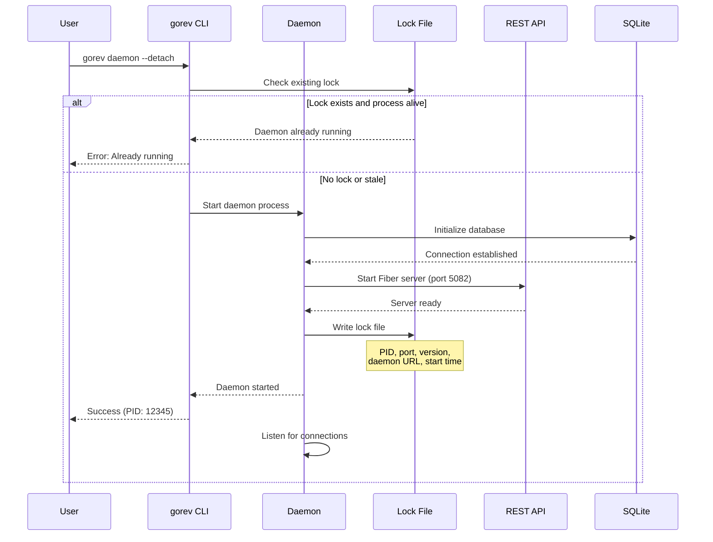
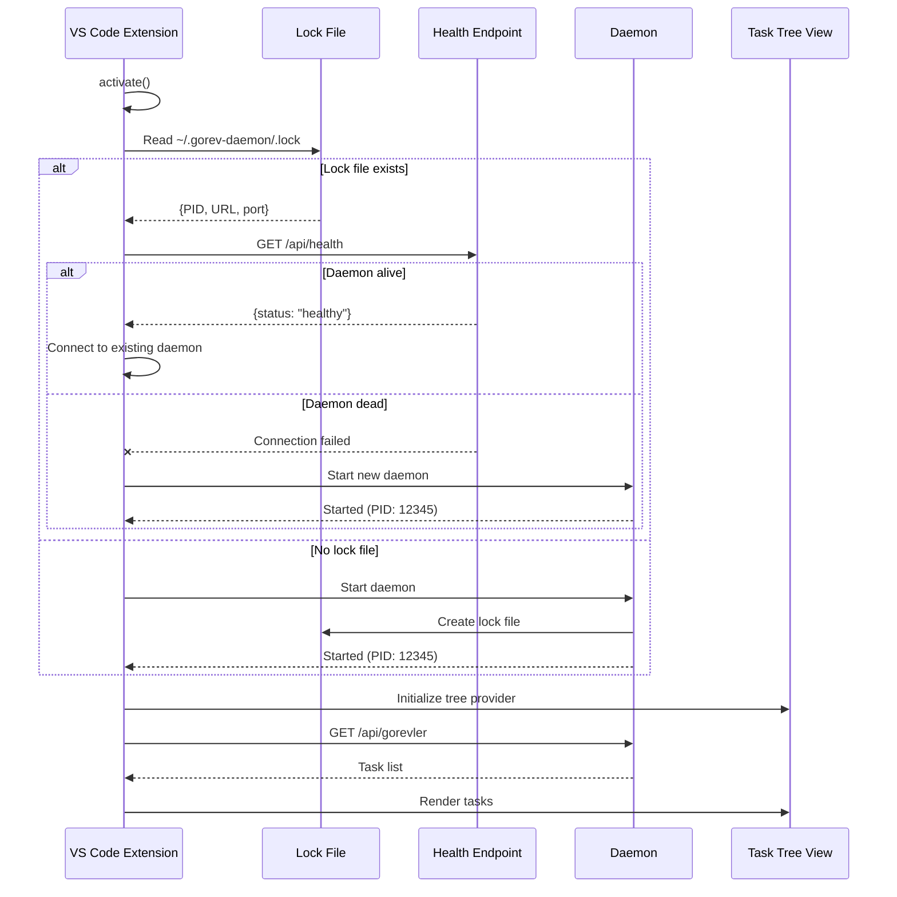
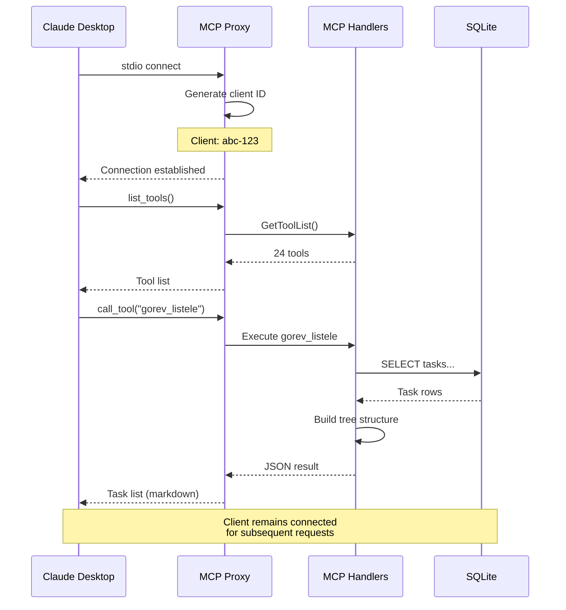
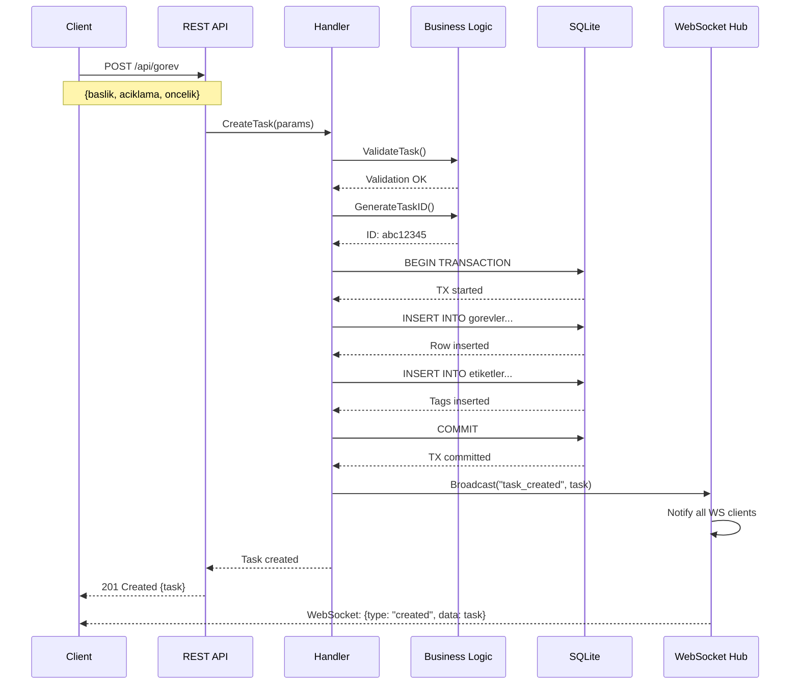
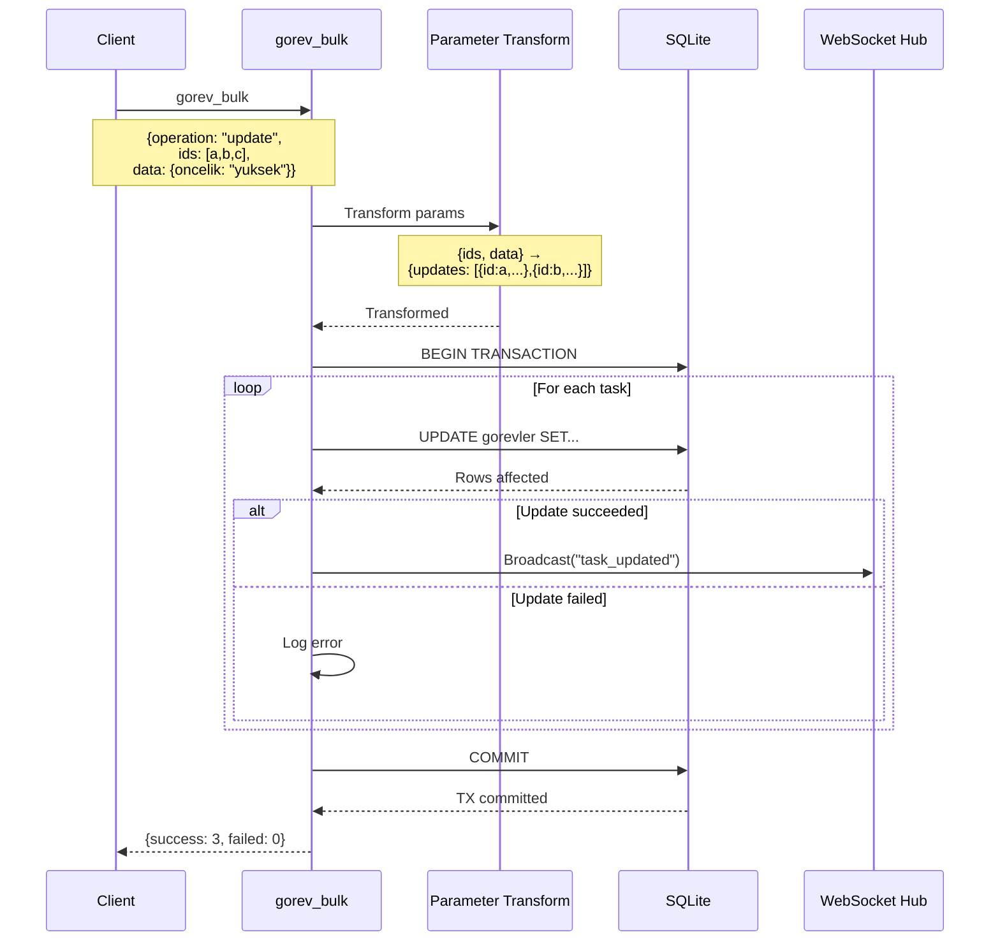
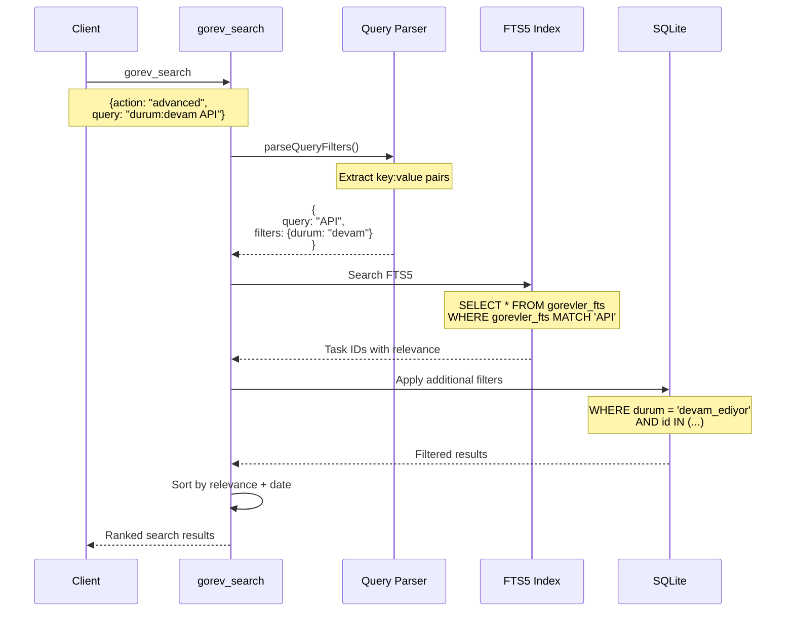
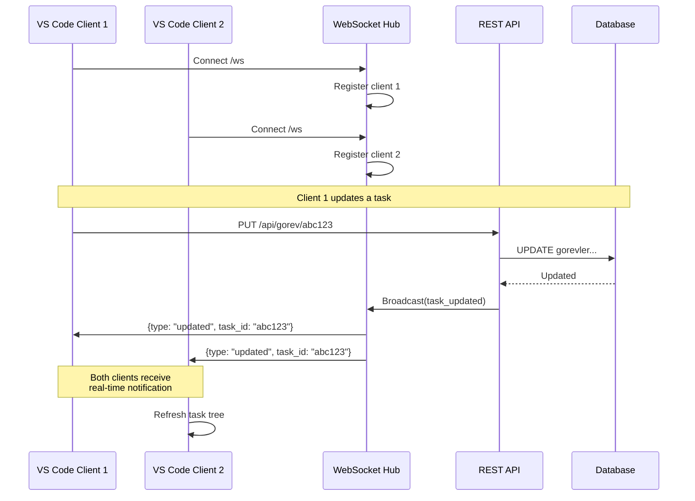
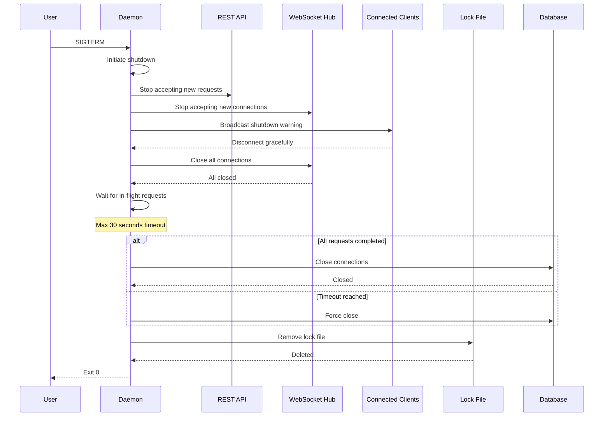
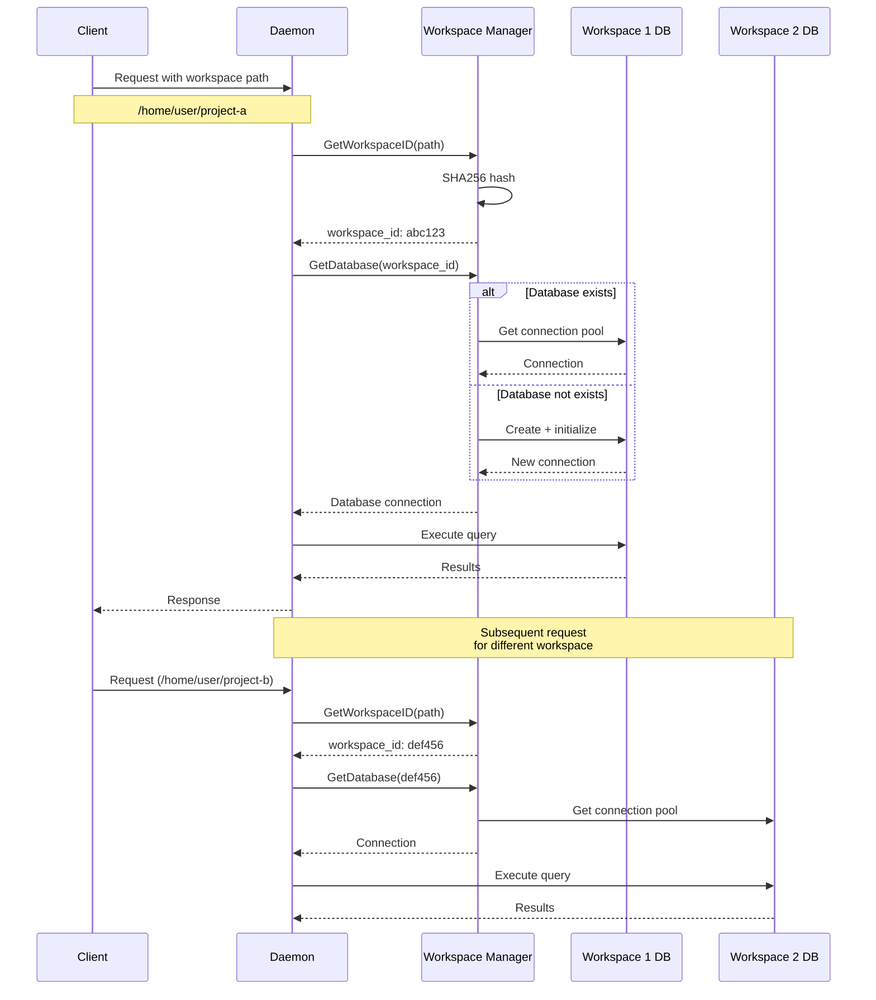
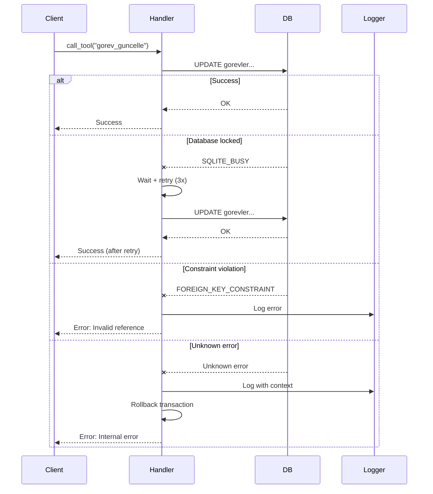

# Sequence Diagrams - Gorev Daemon

**Version:** v0.16.3 | **Last Updated:** October 6, 2025

Detailed sequence diagrams showing the flow of operations in Gorev daemon architecture.

---

## 1. Daemon Startup Sequence

---

## 2. VS Code Extension Auto-Start

---

## 3. MCP Client Connection (Claude)

---

## 4. Task Creation Flow

---

## 5. Bulk Update Flow

---

## 6. Advanced Search Flow (with FTS5)

---

## 7. WebSocket Real-Time Updates

---

## 8. Graceful Shutdown Sequence

---

## 9. Multi-Workspace Handling

---

## 10. Error Handling and Retry Flow

---

## Performance Metrics

Based on v0.16.3 benchmarks:

| Operation | Avg Time | Components Involved |
|-----------|----------|---------------------|
| Daemon Startup | 500-800ms | Lock, DB init, API start |
| Client Connection | 50-100ms | MCP proxy, client registration |
| Task List (50) | 5-15ms | Handler → DB → Tree build |
| Task Create | 3-8ms | Validation → DB insert → WS broadcast |
| Bulk Update (10) | 11-33ms | Transform → 10x DB update → Broadcast |
| Advanced Search | 6-67ms | FTS5 query → Filter → Rank |
| WebSocket Broadcast | 1-2ms | Hub → All clients |

---

## See Also

- [Daemon Architecture](./daemon-architecture.md) - Complete technical documentation
- [API Integration Examples](../api/integration-examples.md) - Client implementation examples
- [Performance Benchmarks](../reports/performance-benchmarks.md) - Detailed metrics

---

**Last Updated:** October 6, 2025 | **Version:** v0.16.3
