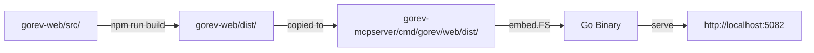

# Web UI Guide

**Version**: v0.16.0
**Last Updated**: October 5, 2025
**Feature Status**: Production Ready ✅

---

## Overview

Gorev v0.16.0 introduces an **embedded web UI** - a modern React + TypeScript interface built directly into the Go binary. This provides a browser-based alternative to the VS Code extension and CLI, with zero configuration required.

### Key Features

- ✅ **Zero Configuration**: Automatically available when MCP server runs
- ✅ **Embedded in Binary**: No separate installation or build step needed
- ✅ **Multi-Workspace Support**: Switch between project workspaces seamlessly
- ✅ **Real-time Updates**: React Query for automatic data synchronization
- ✅ **Bilingual Interface**: Turkish/English language switcher synchronized with MCP server
- ✅ **Full Feature Parity**: All task management features from VS Code extension
- ✅ **Responsive Design**: Works on desktop, tablet, and mobile devices

---

## Quick Start

### 1. Start the MCP Server

```bash
# Using NPX (no installation)
npx @mehmetsenol/gorev-mcp-server serve

# Or if installed globally
gorev-mcp serve
```

### 2. Access Web UI

Open your browser and navigate to:

```
http://localhost:5082
```

That's it! No additional setup required.

---

## Architecture

### Technology Stack

| Layer | Technology | Purpose |
|-------|-----------|---------|
| **Frontend** | React 18 + TypeScript | UI components and state management |
| **Data Fetching** | React Query (TanStack Query) | Caching, synchronization, and optimistic updates |
| **Routing** | React Router v6 | Client-side navigation |
| **Styling** | CSS Modules | Component-scoped styling |
| **Build Tool** | Vite 5 | Fast development and optimized production builds |
| **Backend** | Fiber (Go) | REST API server (23 endpoints) |
| **Embedding** | embed.FS (Go) | Static file serving from binary |

### Build Process



**Production Build**:

1. `cd gorev-web && npm run build` generates optimized static files
2. Output copied to `gorev-mcpserver/cmd/gorev/web/dist/`
3. Go's `embed.FS` packages files into binary at compile time
4. Fiber serves embedded files when `gorev serve` runs

---

## Features

### 1. Multi-Workspace Management

**Workspace Switcher** (Top Right Corner):

- Lists all registered workspaces
- Shows workspace name and task counts
- Click to switch between workspaces
- Auto-saves last selected workspace to localStorage

**Workspace Context**:

- Each workspace has isolated SQLite database (`.gorev/gorev.db`)
- SHA256-based workspace IDs for uniqueness
- Automatic registration when VS Code extension activates
- Manual registration via `gorev init` in workspace root

**HTTP Headers**:

```
X-Workspace-Id: <sha256-hash>
X-Workspace-Path: /path/to/workspace
X-Workspace-Name: Project Name
```

All API requests include these headers for workspace isolation.

### 2. Task Management

**Task Card Components**:

- Visual task cards with metadata (status, priority, due date, tags)
- Expandable/collapsible subtask hierarchy
- Dependency badges showing blocked/blocking relationships
- Quick actions: Edit, Delete, Change Status
- Markdown rendering for task descriptions

**Task Creation**:

- Template-based creation wizard
- Supports all 6 default templates (bug, feature, research, refactor, test, doc)
- Dynamic form generation based on template schema
- Field validation before submission

**Task Filtering**:

- Filter by status (pending, in_progress, completed)
- Filter by priority (low, medium, high)
- Filter by tags (multi-select)
- Search by task title
- Date range filtering

### 3. Project Organization

**Sidebar Navigation**:

- Project list with task counts per status
- Active project highlighting
- Quick project switching
- Project creation modal

**Project Details**:

- Project name, description, creation date
- Task statistics (total, completed, in-progress, pending)
- Task list grouped by status

### 4. Template System

**Available Templates**:

| Alias | Template Name | Use Case |
|-------|--------------|----------|
| `bug` | Bug Raporu | Software bug reports |
| `feature` | Özellik Geliştirme | Feature development |
| `research` | Araştırma | Research and investigation |
| `refactor` | Refactoring | Code refactoring |
| `test` | Test Yazma | Test writing |
| `doc` | Dokümantasyon | Documentation |

**Template Features**:

- Predefined field schemas (title, description, priority, tags, etc.)
- Required vs. optional fields validation
- Select fields with predefined options
- Auto-generated task titles using template patterns

### 5. Language Synchronization

**Bilingual Support**:

- Language switcher in top navigation
- Options: Turkish (Türkçe) / English
- Synchronized with MCP server language setting
- Persisted to localStorage

**Translation Coverage**:

- All UI labels and buttons
- Status names (Beklemede, Devam Ediyor, Tamamlandı)
- Priority levels (Düşük, Orta, Yüksek)
- Error messages and notifications
- Template names and descriptions

---

## API Integration

### REST API Endpoints

The Web UI communicates with the Fiber-based REST API server:

| Category | Endpoint | Method | Description |
|----------|----------|--------|-------------|
| **Workspaces** | `/api/workspaces` | GET | List all workspaces |
| | `/api/workspaces/register` | POST | Register new workspace |
| **Tasks** | `/api/tasks` | GET | List tasks (with filters) |
| | `/api/tasks` | POST | Create task |
| | `/api/tasks/:id` | GET | Get task details |
| | `/api/tasks/:id` | PUT | Update task |
| | `/api/tasks/:id` | DELETE | Delete task |
| **Projects** | `/api/projects` | GET | List projects |
| | `/api/projects` | POST | Create project |
| | `/api/projects/:id` | GET | Get project details |
| | `/api/projects/:id/tasks` | GET | Get project tasks |
| **Templates** | `/api/templates` | GET | List templates |
| | `/api/templates/:id` | GET | Get template details |
| | `/api/tasks/from-template` | POST | Create task from template |

### React Query Integration

**Query Keys**:

```typescript
['workspaces'] // All workspaces
['projects', workspaceId] // Projects for workspace
['tasks', workspaceId, filters] // Filtered tasks
['task', taskId] // Single task details
['templates'] // All templates
```

**Optimistic Updates**:

- Task status changes reflected immediately in UI
- Background sync with server
- Automatic rollback on error

**Automatic Refetching**:

- On window focus (staleTime: 60 seconds)
- On network reconnect
- On workspace switch (invalidates all queries)

---

## Development

### Local Development Setup

**Prerequisites**:

- Node.js 18+ and npm
- Go 1.23+
- Running MCP server (API backend)

**Steps**:

1. **Start API Server**:

```bash
cd gorev-mcpserver
./gorev serve --api-port 5082 --debug
```

2. **Start Dev Server** (separate terminal):

```bash
cd gorev-web
npm install
npm run dev
```

3. **Access**:

```
http://localhost:5001  # Dev server with hot reload
http://localhost:5082  # Production embedded UI (from Go binary)
```

### Development Workflow

**Hot Reload**: Vite provides instant hot module replacement (HMR)

**API Proxy**: Dev server proxies API requests to `http://localhost:5082` (configured in `vite.config.ts`)

**TypeScript**: Full type safety with `npm run type-check`

**Linting**: ESLint with React plugins (`npm run lint`)

**Build**: `npm run build` creates optimized production bundle

### Project Structure

```
gorev-web/
├── src/
│   ├── api/
│   │   └── client.ts           # API client + React Query hooks
│   ├── components/
│   │   ├── Sidebar.tsx         # Project navigation
│   │   ├── TaskCard.tsx        # Task display component
│   │   ├── TaskForm.tsx        # Task creation form
│   │   ├── TemplateWizard.tsx  # Template selection
│   │   └── WorkspaceSwitcher.tsx
│   ├── contexts/
│   │   └── WorkspaceContext.tsx # Global workspace state
│   ├── types/
│   │   └── index.ts            # TypeScript type definitions
│   ├── App.tsx                 # Main application component
│   └── main.tsx                # React entry point
├── public/                      # Static assets
├── package.json
├── vite.config.ts              # Vite configuration
└── tsconfig.json               # TypeScript configuration
```

### Adding New Features

**Example: Add New API Endpoint**

1. **Define TypeScript Type** (`src/types/index.ts`):

```typescript
export interface TaskComment {
  id: string;
  taskId: string;
  content: string;
  createdAt: string;
}
```

2. **Add API Function** (`src/api/client.ts`):

```typescript
export const getTaskComments = async (taskId: string): Promise<TaskComment[]> => {
  const { data } = await api.get(`/api/tasks/${taskId}/comments`);
  return data.comments;
};
```

3. **Create React Query Hook** (`src/api/client.ts`):

```typescript
export const useTaskComments = (taskId: string) => {
  return useQuery({
    queryKey: ['task-comments', taskId],
    queryFn: () => getTaskComments(taskId),
    enabled: !!taskId,
  });
};
```

4. **Use in Component**:

```typescript
const TaskComments: React.FC<{ taskId: string }> = ({ taskId }) => {
  const { data: comments, isLoading } = useTaskComments(taskId);

  if (isLoading) return <div>Loading...</div>;

  return (
    <div>
      {comments?.map(comment => (
        <div key={comment.id}>{comment.content}</div>
      ))}
    </div>
  );
};
```

---

## Production Deployment

### Building for Production

**1. Build Web UI**:

```bash
cd gorev-web
npm run build
```

This creates optimized static files in `dist/` directory.

**2. Copy to Go Project**:

```bash
cp -r dist/* ../gorev-mcpserver/cmd/gorev/web/dist/
```

**3. Build Go Binary**:

```bash
cd ../gorev-mcpserver
make build-all
```

This embeds the web UI into platform-specific binaries.

**4. Verify Embedding**:

```bash
./gorev serve --debug
# Should log: "📦 Web UI embedded in binary, serving from memory"
```

### Deployment Options

**Option 1: NPM Package** (Recommended):

```bash
npm install -g @mehmetsenol/gorev-mcp-server
gorev-mcp serve
```

Web UI automatically available at http://localhost:5082

**Option 2: Docker** (Future):

```bash
docker run -p 5082:5082 ghcr.io/msenol/gorev:latest
```

**Option 3: Standalone Binary**:
Download from [GitHub Releases](https://github.com/msenol/gorev/releases), then:

```bash
chmod +x gorev-linux-amd64
./gorev-linux-amd64 serve
```

---

## Configuration

### Environment Variables

| Variable | Description | Default |
|----------|-------------|---------|
| `GOREV_API_PORT` | Web UI port | `5082` |
| `GOREV_LANG` | UI language | `tr` |
| `GOREV_DB_PATH` | Database path | Auto-detected |

**Example**:

```bash
GOREV_API_PORT=8080 GOREV_LANG=en gorev serve
```

### Port Configuration

**Change Default Port**:

```bash
gorev serve --api-port 8080
```

Web UI will be available at http://localhost:8080

---

## Troubleshooting

### Common Issues

#### 1. Web UI Not Loading

**Symptoms**: 404 errors, blank page

**Solutions**:

```bash
# Check if server is running
curl http://localhost:5082/api/health

# Verify embedded files
gorev serve --debug  # Should log "Web UI embedded in binary"

# Check port availability
lsof -i :5082  # Linux/macOS
netstat -ano | findstr :5082  # Windows
```

#### 2. API Connection Errors

**Symptoms**: "Network Error", "Failed to fetch"

**Solutions**:

```bash
# Verify API server is running
gorev serve --debug

# Check CORS configuration (should allow localhost:5001 in dev)
# Check workspace headers in browser DevTools → Network tab

# Test API directly
curl -H "X-Workspace-Id: test" http://localhost:5082/api/workspaces
```

#### 3. Workspace Not Loading

**Symptoms**: Empty workspace list, "No workspace selected"

**Solutions**:

```bash
# Initialize workspace
cd /path/to/project
gorev init

# Verify database exists
ls -la .gorev/gorev.db

# Check workspace registration
sqlite3 .gorev/gorev.db "SELECT * FROM workspace_metadata;"
```

#### 4. Language Not Switching

**Symptoms**: UI stays in Turkish despite setting English

**Solutions**:

```bash
# Clear localStorage
# Browser DevTools → Application → Local Storage → Clear All

# Restart server with language flag
gorev serve --lang=en

# Check if MCP server environment variable is set
echo $GOREV_LANG
```

---

## Performance

### Optimization Strategies

**1. Code Splitting**:

- React Router lazy loading for routes
- Dynamic imports for large components
- Reduces initial bundle size

**2. Caching**:

- React Query cache (5 minutes default)
- localStorage for workspace preference
- Browser cache for static assets (1 year)

**3. Bundle Size**:

- Production build: ~250KB gzipped
- Vite tree-shaking removes unused code
- No external CDN dependencies

**4. API Efficiency**:

- Batched queries where possible
- Optimistic UI updates reduce perceived latency
- Debounced search input (300ms)

---

## Security

### Considerations

1. **Local-Only**: Web UI runs on localhost by default
2. **No Authentication**: Designed for single-user local usage
3. **CORS**: Restricted to localhost origins
4. **Database Access**: Direct SQLite access, no encryption
5. **XSS Protection**: React escapes user input by default
6. **CSRF**: Not applicable (same-origin requests)

### Production Hardening (Future)

- Optional authentication layer
- HTTPS support with self-signed certificates
- Remote access via SSH tunnel
- Database encryption option

---

## Browser Compatibility

| Browser | Version | Status |
|---------|---------|--------|
| Chrome | 90+ | ✅ Fully Supported |
| Firefox | 88+ | ✅ Fully Supported |
| Safari | 14+ | ✅ Fully Supported |
| Edge | 90+ | ✅ Fully Supported |
| Opera | 76+ | ✅ Fully Supported |

**Required Features**:

- ES6 modules support
- Fetch API
- LocalStorage API
- CSS Grid and Flexbox

---

## Future Enhancements

### Roadmap

- [ ] **Real-time Collaboration**: WebSocket support for multi-user editing
- [ ] **Dark Mode**: User preference for dark/light theme
- [ ] **Keyboard Shortcuts**: Vim-style navigation
- [ ] **Gantt Chart View**: Timeline visualization for tasks
- [ ] **Export/Import UI**: Visual interface for data backup/restore
- [ ] **Mobile App**: React Native wrapper for iOS/Android
- [ ] **PWA Support**: Install as Progressive Web App
- [ ] **Offline Mode**: Service worker for offline functionality

---

## Comparison: Web UI vs. VS Code Extension

| Feature | Web UI | VS Code Extension |
|---------|--------|-------------------|
| **Installation** | None (embedded) | Marketplace install |
| **Platform** | Any browser | VS Code/Cursor/Windsurf |
| **Setup** | Zero config | MCP config file |
| **Task Creation** | ✅ Full support | ✅ Full support |
| **Subtasks** | ✅ Visual hierarchy | ✅ TreeView |
| **Templates** | ✅ Wizard UI | ✅ Quick pick |
| **Multi-Workspace** | ✅ Switcher | ✅ Auto-detection |
| **Real-time Updates** | ✅ React Query | ❌ Manual refresh |
| **Mobile Access** | ✅ Responsive | ❌ Desktop only |
| **Offline** | ❌ Requires server | ✅ Local MCP |
| **AI Integration** | ❌ None | ✅ Claude/Copilot |

**Use Web UI When**:

- You want browser-based access
- You need mobile/tablet support
- You don't use VS Code daily
- You want real-time data synchronization

**Use VS Code Extension When**:

- You work primarily in VS Code
- You need AI assistant integration (Claude Code, Copilot)
- You want keyboard-driven workflow
- You need offline access

---

## Contributing

### Reporting Bugs

Found a bug in the Web UI? Please report it at:
https://github.com/msenol/gorev/issues

Include:

- Browser name and version
- Steps to reproduce
- Screenshots or screen recordings
- Browser console errors (DevTools → Console)

### Feature Requests

Submit feature requests with:

- Use case description
- Expected behavior
- Mockups or wireframes (if applicable)

### Pull Requests

1. Fork the repository
2. Create feature branch: `git checkout -b feature/web-ui-improvement`
3. Make changes in `gorev-web/src/`
4. Test locally: `npm run dev`
5. Build: `npm run build`
6. Submit PR with description and screenshots

---

## Additional Resources

- **API Reference**: [REST API Documentation](../developer/api-reference.md)
- **Multi-Workspace Guide**: [Multi-Workspace Support](multi-workspace.md)
- **Template System**: [Template System Guide](template-system.md)
- **GitHub Repository**: https://github.com/msenol/gorev
- **NPM Package**: https://www.npmjs.com/package/@mehmetsenol/gorev-mcp-server

---

**Need Help?** Open an issue at [GitHub Issues](https://github.com/msenol/gorev/issues) with the `web-ui` label.
