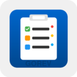

# Gorev VS Code Extension

<p align="center">
  
</p>

Gorev için güçlü ve kullanıcı dostu VS Code extension'ı. MCP protokolü üzerinden Gorev sunucusuyla iletişim kurarak gelişmiş görev yönetimi özellikleri sunar.

## 🚀 Özellikler

### Enhanced TreeView
- **Gruplama**: Durum, öncelik, proje, etiket veya son tarihe göre görevleri gruplayın
- **Çoklu Seçim**: Ctrl/Cmd+Click ile birden fazla görevi seçin
- **Sıralama**: Başlık, öncelik, son tarih ve daha fazlasına göre sıralayın
- **Renk Kodlaması**: Öncelik bazlı görsel ayırt edicilik
- **Hızlı Tamamlama**: Checkbox ile tek tıkla tamamlama
- **Badges**: Görev sayıları ve son tarih uyarıları

### Drag & Drop Desteği
- 🔄 Görevleri projeler arası taşıma
- 📊 Sürükleyerek durum değiştirme
- 🎯 Öncelik sıralaması değiştirme
- 🔗 Bağımlılık oluşturma (görev üzerine bırakarak)
- ✨ Görsel geri bildirim ve animasyonlar

### Inline Düzenleme
- ✏️ F2 veya double-click ile hızlı düzenleme
- 📝 Context menu ile durum/öncelik değiştirme
- 📅 Inline tarih seçici
- ❌ Escape ile iptal, ✅ Enter ile kaydet

### Gelişmiş Filtreleme
- 🔍 Gerçek zamanlı arama
- 🎛️ Gelişmiş filtreler (durum, öncelik, etiket, tarih)
- 💾 Kayıtlı filtre profilleri
- 📊 Status bar entegrasyonu
- ⚡ Hızlı filtre kısayolları

### Zengin Görev Detayı
- 📝 Split-view markdown editörü
- 👁️ Canlı önizleme
- 🔗 Bağımlılık görselleştirme grafiği
- 📊 Aktivite zaman çizelgesi
- 🏷️ Template alan göstergeleri

### Template Wizard
- 🧙 Çok adımlı arayüz
- 🔍 Template arama ve filtreleme
- 📋 Dinamik form oluşturma
- ✅ Alan doğrulama
- 👁️ Oluşturma öncesi önizleme

### Görev Yönetimi
- ✅ Hızlı görev oluşturma (Ctrl+Shift+G)
- 📝 Görev detaylarını görüntüleme
- 🔄 Durum güncelleme
- 🗑️ Toplu silme işlemleri
- 🏷️ Etiket yönetimi
- 📅 Son tarih takibi
- 🔗 Bağımlılık yönetimi

### Proje Yönetimi
- 📁 Proje oluşturma ve yönetimi
- 🎯 Aktif proje seçimi
- 📊 Proje bazlı görev görüntüleme
- 📈 Görev istatistikleri

### Template Sistemi
- 📋 Hazır görev şablonları (Bug, Feature, Technical Debt, Research)
- ⚡ Template wizard ile hızlı görev oluşturma
- 🔧 Özelleştirilebilir alanlar
- 🎨 Kategori bazlı organizasyon

## 📦 Kurulum

1. VS Code'da extension'ı yükleyin
2. Gorev MCP sunucusunun yolunu ayarlayın:
   ```json
   "gorev.serverPath": "/path/to/gorev"
   ```

## ⚙️ Konfigürasyon

### Temel Ayarlar
| Ayar | Açıklama | Varsayılan |
|------|----------|------------|
| `gorev.serverPath` | Gorev sunucu yolu | - |
| `gorev.autoConnect` | Başlangıçta otomatik bağlan | `true` |
| `gorev.showStatusBar` | Status bar'ı göster | `true` |
| `gorev.refreshInterval` | Otomatik yenileme aralığı (saniye) | `30` |

### TreeView Ayarları
| Ayar | Açıklama | Varsayılan |
|------|----------|------------|
| `gorev.treeView.grouping` | Gruplama stratejisi | `status` |
| `gorev.treeView.sorting` | Sıralama kriteri | `priority` |
| `gorev.treeView.sortAscending` | Artan sıralama | `false` |
| `gorev.treeView.showCompleted` | Tamamlanan görevleri göster | `true` |
| `gorev.treeView.showEmptyGroups` | Boş grupları göster | `false` |

### Drag & Drop Ayarları
| Ayar | Açıklama | Varsayılan |
|------|----------|------------|
| `gorev.dragDrop.allowTaskMove` | Görev taşımaya izin ver | `true` |
| `gorev.dragDrop.allowStatusChange` | Durum değiştirmeye izin ver | `true` |
| `gorev.dragDrop.allowPriorityChange` | Öncelik değiştirmeye izin ver | `true` |
| `gorev.dragDrop.allowProjectMove` | Projeler arası taşıma | `true` |
| `gorev.dragDrop.allowDependencyCreate` | Bağımlılık oluşturma | `true` |
| `gorev.dragDrop.showDropIndicator` | Drop göstergelerini göster | `true` |
| `gorev.dragDrop.animateOnDrop` | Drop animasyonları | `true` |

## 🎮 Klavye Kısayolları

- `Ctrl+Shift+G`: Hızlı görev oluştur
- `Ctrl+Shift+P`: Proje oluştur
- `Ctrl+Shift+T`: Template wizard'ı aç
- `Ctrl+R`: Görevleri yenile (TreeView odaktayken)
- `F2`: Görev başlığını düzenle
- `Delete`: Seçili görevi sil
- `Enter`: Görev detaylarını göster

## 📋 Komutlar

### Görev Komutları
- `Gorev: Create Task` - Yeni görev oluştur
- `Gorev: Edit Task` - Görevi düzenle
- `Gorev: Delete Task` - Görevi sil
- `Gorev: Complete Task` - Görevi tamamla
- `Gorev: Start Task` - Göreve başla
- `Gorev: Show Task Detail` - Görev detayını göster
- `Gorev: Add Dependency` - Bağımlılık ekle

### Proje Komutları
- `Gorev: Create Project` - Yeni proje oluştur
- `Gorev: Set Active Project` - Aktif proje seç
- `Gorev: Clear Active Project` - Aktif projeyi kaldır

### Template Komutları
- `Gorev: Create Task from Template` - Template'den görev oluştur
- `Gorev: Show Template Wizard` - Template wizard'ı göster
- `Gorev: Refresh Templates` - Template'leri yenile

### Genel Komutlar
- `Gorev: Connect to Server` - Sunucuya bağlan
- `Gorev: Disconnect` - Bağlantıyı kes
- `Gorev: Refresh` - Tüm verileri yenile
- `Gorev: Show Summary` - Özet bilgileri göster
- `Gorev: Show Search Input` - Arama kutusunu göster
- `Gorev: Show Advanced Filter` - Gelişmiş filtreleri göster
- `Gorev: Toggle Grouping` - Gruplama modunu değiştir
- `Gorev: Clear Filters` - Tüm filtreleri temizle

## 🛠️ Geliştirme

```bash
# Bağımlılıkları yükle
npm install

# TypeScript'i derle
npm run compile

# Watch modunda çalıştır
npm run watch

# Extension'ı paketle
npm run package
```

### 🧪 Test

```bash
# Tüm testleri çalıştır
npm test

# Test coverage raporu
npm run test-coverage

# Watch modunda test
npm run test-watch
```

Test suite şunları içerir:
- **Unit Tests**: Markdown parser, MCP client, tree providers
- **Integration Tests**: Extension activation, command registration
- **E2E Tests**: Tam kullanıcı iş akışları

## 📝 Lisans

MIT

## 🤝 Katkıda Bulunma

Pull request'ler kabul edilir. Büyük değişiklikler için lütfen önce bir issue açın.